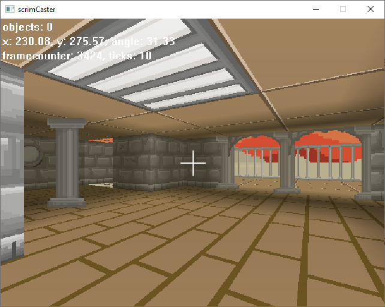

This is a basic 2.5D Raycaster written in C (with some minor bits of C++) using SDL for windowing. It supports texture mapping walls, sprites, horizontally scrolling surfaces, usable doors, semi-transparent walls and sideways mouselook.

